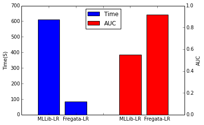
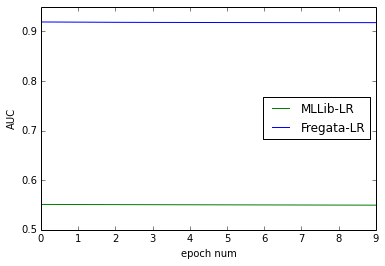
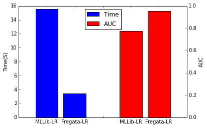
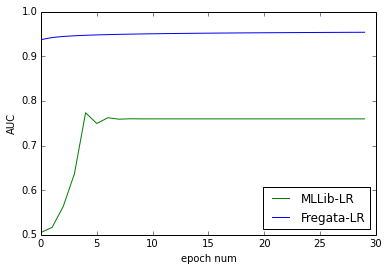

Logistic Regression
=================
Introduction
------------
>  **[Logistic Regression](https://en.wikipedia.org/wiki/Logistic_regression)** is used to estimate the probability of a binary response based on one or more predictor (or independent) variables (features).

> Fregata's Logistic Regression has the advantages below to make it more suitable for industry communities with large datasets:
> 
> - High Speed: it often converges in one data epoch
> - Parameter Free: the learning rate of GSA is self-adaptive

Experiments
------------
> expriment #1 on large scale dataset(300million X 20million), it shows that Fregata-LR is better than MLLib-LR either in time consuming or auc score.
> 
> 
> 
> 

> expriment #2 on [eplison](https://www.csie.ntu.edu.tw/~cjlin/libsvmtools/datasets/binary.html#epsilon) dataset, it also shows that Fregata-LR using less time but getting better auc.

> 
> 
> 

Example
------------

```scala

  import fregata.spark.data.LibSvmReader
  import fregata.spark.metrics.classification.{AreaUnderRoc, Accuracy}
  import fregata.spark.model.classification.{LogisticRegression}
  import org.apache.spark.{SparkConf, SparkContext}

  /**
   * Created by takun on 16/9/19.
   */

  def main(args: Array[String]): Unit = {
    val conf = new SparkConf().setAppName("logistic regression")
    val sc = new SparkContext(conf)
    // the dataset a9a can be downloaded from https://www.csie.ntu.edu.tw/~cjlin/libsvmtools/datasets/binary.html#a9a
    val (_,trainData) = LibSvmReader.read(sc,"/Volumes/takun/data/libsvm/a9a",123)
    val (_,testData) = LibSvmReader.read(sc,"/Volumes/takun/data/libsvm/a9a.t",123)
    val model = LogisticRegression.run(trainData)
    val pd = model.classPredict(testData)
    val acc = Accuracy.of( pd.map{
      case ((x,l),(p,c)) =>
        c -> l
    })
    val auc = AreaUnderRoc.of( pd.map{
      case ((x,l),(p,c)) =>
        p -> l
    })
    val loss = fregata.spark.loss.log(pd.map{
      case ((x,l),(p,c)) =>
        if( l == 1d ) {
          (l,c,p)
        }else{
          ( l , c , 1-p )
        }
    })
    println( s"AreaUnderRoc = $auc ")
    println( s"Accuracy = $acc ")
    println( s"LogLoss = $loss ")
  }

```

    AreaUnderRoc = 0.8994970571693367 
    Accuracy = 0.8479302297015109 
    LogLoss = 0.3289042625265748
